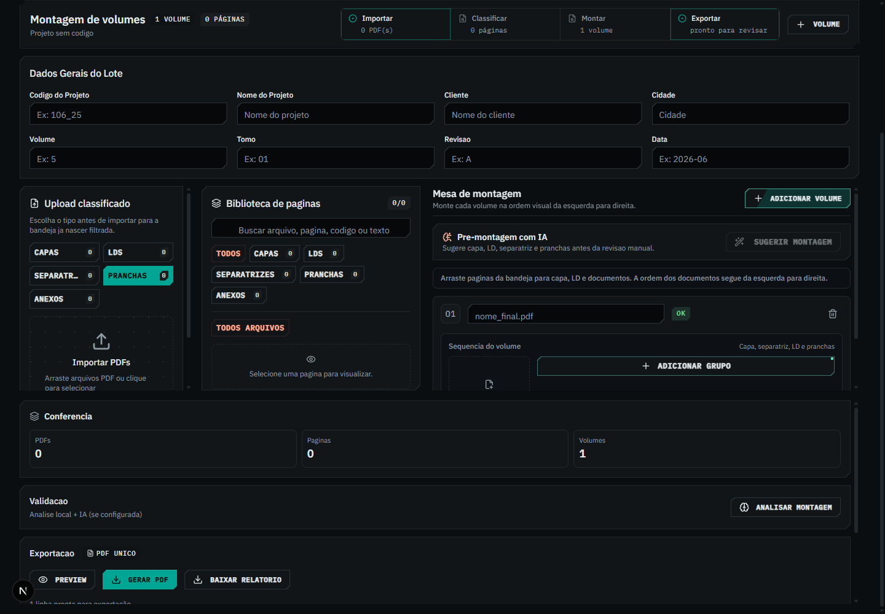
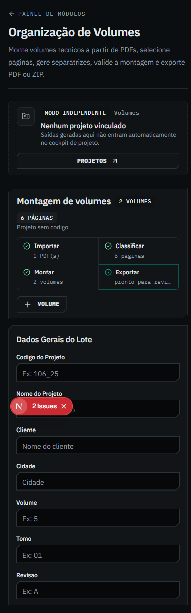
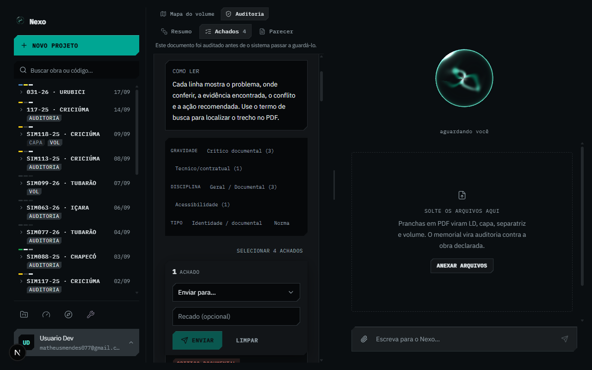
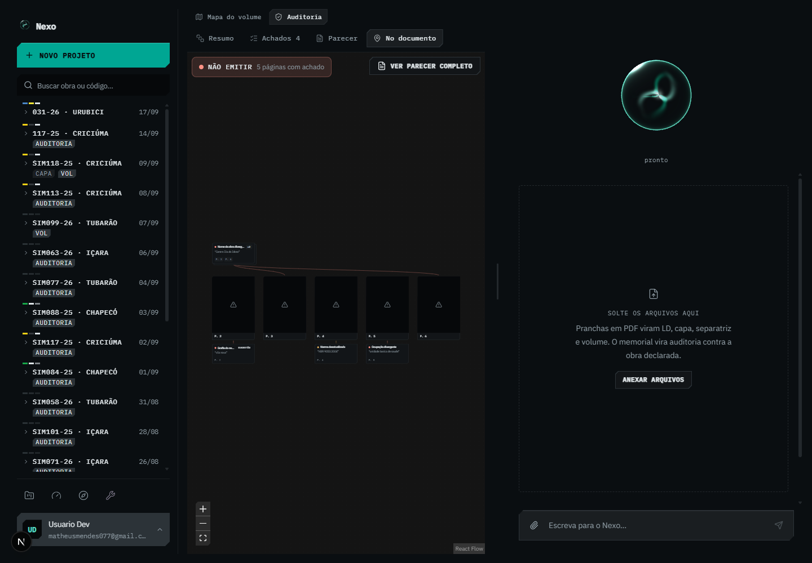
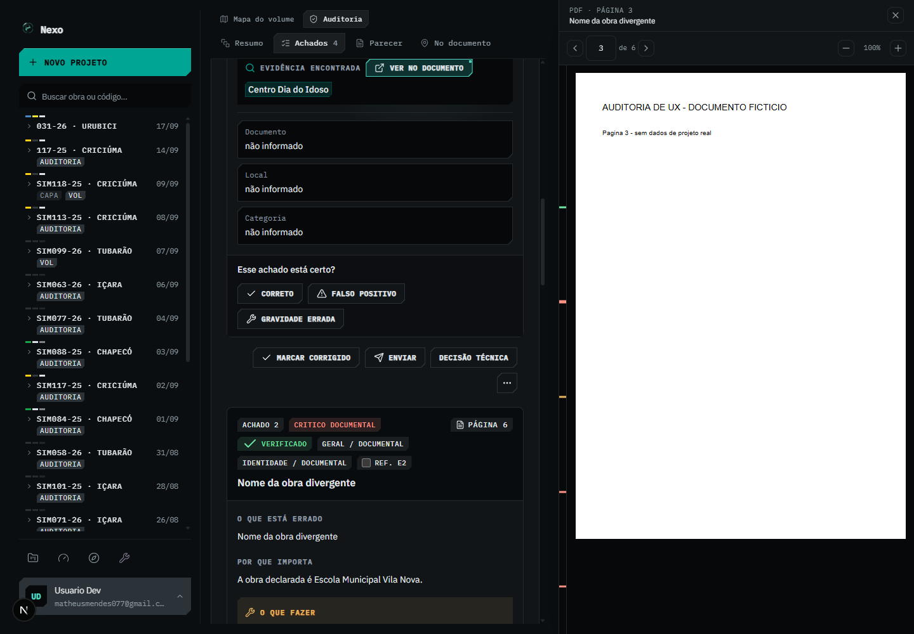
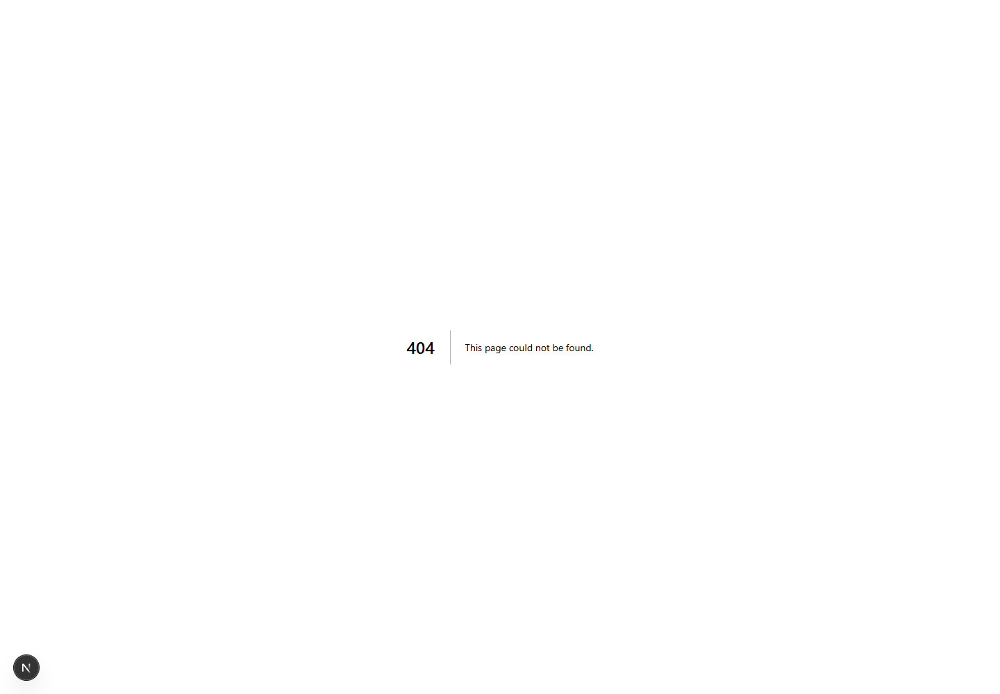
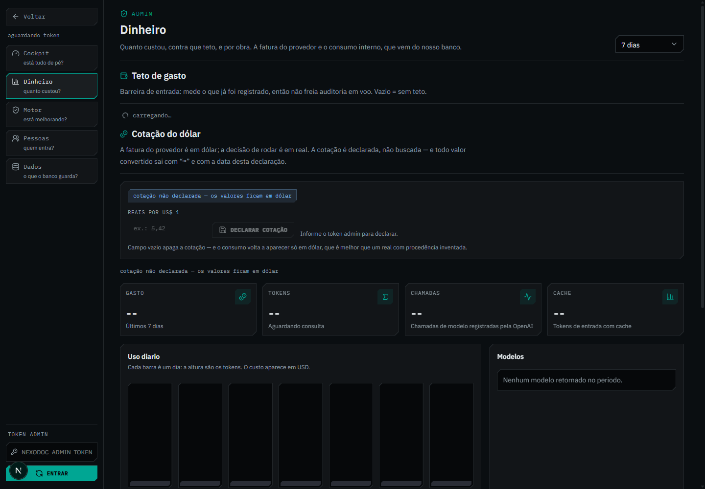
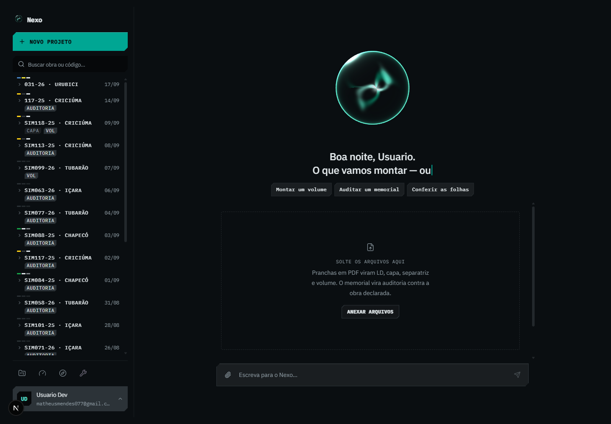

# Evidências e validação — auditoria UX/UI

Relacionado: [relatório](auditoria-ux-ui-2026-09-27.md) · [inventário](inventario-funcional-ux-ui-2026-09-27.md).

## Ambiente e origem

Aplicação local em `http://localhost:3000`, checkout de trabalho, modo de autenticação de desenvolvimento existente. Inspeção em 27/09 e consolidação em 28/09/2026. As capturas mostram registros já disponíveis nessa conta e um parecer controlado; não representam uma nova auditoria de documentos de cliente em produção.

No contexto isolado de interação, requisições de escrita em `/api/**` foram interceptadas. O fixture de parecer usa quatro achados; o PDF de seis páginas foi criado localmente com identificação de documento fictício. Não houve chamada paga de IA, envio de e-mail, exclusão de registros de trabalho ou alteração de permissões para provar os problemas. O tutorial foi exercitado no contexto original e sua própria conversa de exemplo foi removida pelo fluxo de encerramento do tutorial.

## Capturas representativas

### E01 · Volume vazio indicado como pronto — V01

**Reprodução executada:** abrir `/volumes`, adicionar um volume sem importar PDF, observar status e exportação. O teste verificou a interface; não baixou uma exportação vazia.

### E02 · Montagem sem área útil no celular — V04

**Reprodução executada:** `/volumes` em 390×844. Painéis operacionais medidos com altura 0; conteúdo superior ocupa a área disponível e o trabalho não fica acessível.

### E03 · Achados em notebook — G05/A07

**Reprodução executada:** parecer fictício com quatro achados em 1280×800. Área central medida em 368 px no arranjo observado. Em 1440, a área central foi 528 px e cards chegaram a cerca de 1056 px de altura.

### E04 · PDF remoto disponível no visor e ausente no mapa — A02

**Reprodução executada:** abrir auditoria controlada com arquivo identificado por checksum; endpoint de arquivo entrega PDF fictício local. Primeiro abrir “No documento”; depois “Ver no documento” no achado. O mapa mostra falhas, mas o visor renderiza o mesmo PDF. Este ensaio verifica disponibilidade da fonte, não exatidão dos realces.

### E05 · Ação do projeto leva a 404 — G03

**Reprodução executada:** detalhe de projeto → Capas. O mesmo problema de rota foi confirmado para LD. Não criar páginas vazias só para eliminar o 404: o destino precisa abrir a função existente com o contexto correto.

### E06 · Mensagem administrativa enganosa antes de carregar — P02

**Reprodução executada:** abrir Dinheiro sem preencher token adicional. A mensagem “Sem DATABASE_URL” aparece sem resposta que confirme essa condição. Não se concluiu nada sobre a configuração real de produção.

### E07 · Falha do link não aparece — A01

**Reprodução executada:** contexto isolado sem conversa anterior local; `GET /api/audits/ux-missing` responde 404; abrir `/nexo?auditoria=ux-missing`, aguardar e inspecionar. O shell permanece na saudação, sem palco e sem a mensagem de erro esperada.

## Outros ensaios executados

| Ensaio | Resultado observado | Limite |
|---|---|---|
| Nomear rascunho de volume e recarregar | Volume desapareceu; sem recuperação | Não houve exportação real |
| Focar miniatura e pressionar Enter | Seleção não ocorreu como pelo clique | Não é auditoria completa de leitor de tela |
| Criar dois volumes e usar inserção Capa/LD/Docs | Destino por clique é primeiro volume/grupo | Nenhum dado de cliente foi modificado |
| Inspecionar nomes acessíveis na montagem com arquivo/grupos | Sete botões nativos sem nome | Contagem desse estado específico, não total global |
| Abrir Nexo em 390×844 | Portão de tela maior impede revisão | Restrição deliberada no CSS |
| Abrir home, projetos, detalhe e ferramentas | Percursos e rótulos inspecionados | Sem criar/excluir projeto |
| Abrir cinco páginas administrativas | Estados anteriores ao token inspecionados | Operações autenticadas por token não executadas |
| Login com erro | Mensagem de erro inspecionada | OAuth real não concluído |

Material adicional local está em `scratchpad/audit-ux-ui-2026-09-27/`, incluindo capturas nas demais larguras, `fixture-6-paginas.pdf` e saídas do detector. Essa pasta é auxiliar e pode não ser versionada; as oito imagens acima foram copiadas para a documentação para preservar a evidência principal.

## Detector: resultado e interpretação

| Recorte | Apontamentos consultivos | Tipo |
|---|---:|---|
| Volume builder | 45 | `design-system-font-size` |
| Componentes compartilhados | 109 | `design-system-font-size` |
| Nexo | 106 | `design-system-font-size` |
| **Total** | **260** | Deriva em relação à escala declarada |

Todos são consultivos. Não são 260 violações de acessibilidade. Há tamanhos pequenos intencionais para microrrótulos; a ação é reconciliar documentação/tokens e verificar a leitura de informação decisiva. O detector não substitui medição de contraste, navegação por teclado e observação de tarefas reais.

## Roteiro de aceite após as correções — ainda não executado

### Montagem

1. Criar projeto ou escolher modo independente; importar capa, LD, pranchas e anexo.
2. Corrigir uma classificação; selecionar intervalo de páginas com teclado.
3. Criar dois volumes, cada um com dois grupos; inserir diretamente no segundo grupo do segundo volume.
4. Trocar capa, mover documento, mover grupo, remover arquivo utilizado e desfazer cada operação.
5. Recarregar e reabrir em outra aba: conferir manifesto e disponibilidade dos arquivos, respeitando as garantias local/servidor.
6. Conferir montagem; alterar uma página e confirmar invalidação da conferência anterior.
7. Abrir prévia individual de cada volume; verificar sequência, nomes e totais; exportar PDF/ZIP em ambiente de teste autorizado.
8. Simular armazenamento indisponível, arquivo rejeitado e erro de geração. Verificar recuperação sem perder o restante.

### Achados

1. Abrir link de achado com e sem sessão; testar válido, removido, sem acesso e falha de rede.
2. Usar busca e filtros para encontrar um responsável e uma referência; abrir evidência sem perder a fila.
3. Usar auditoria com duas fontes e revisões distintas; conferir arquivo/revisão/página correta em card, mapa e visor.
4. Confirmar validade sem marcar correção; atribuir em lote; registrar decisão técnica com justificativa.
5. Publicar comentário em ambiente de teste, verificar em segunda sessão, simular falha de envolvidos e preservar rascunho.
6. Percorrer anterior/próximo achado com teclado; copiar link e exportar cartão com descrição correta do formato.
7. Repetir leitura em 1280×800, 390×844 e zoom 200%. Validar foco, nomes, estados e alvos de interação.

### Cobertura global

1. Percorrer todas as ações do detalhe do projeto e favoritos antigos; nenhum 404 nem troca silenciosa de contexto.
2. Validar admin nos estados não autenticado para dados, carregando, sucesso vazio, sucesso com dados, erro e resposta antiga.
3. Revisar cada linha do inventário contra navegação, contexto, paleta e ajuda.
4. Executar perfil de desempenho com parecer pequeno e grande; medir requisições, interação, memória e renderização antes de otimizar por suposição.

## Validação com usuários sugerida

Realizar sessões curtas com pessoas que montam volumes e pessoas que recebem achados, incluindo pelo menos alguém que ainda não conhece o produto. Tarefas: localizar montagem, montar o segundo volume, recuperar após F5, localizar evidência, atribuir e reabrir link recebido.

Registrar conclusão sem ajuda, erros de destino, perda de contexto, tempo até primeira evidência e uso de voltar/refazer. Esses números ainda não foram medidos. Metas iniciais: nenhuma perda de rascunho, nenhum destino documental incorreto, nenhum 404 em ação visível e todas as operações principais concluíveis por teclado.
